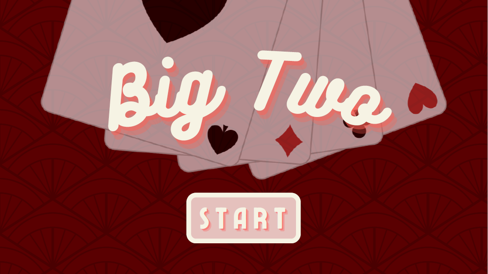

<h1 align="center">
  <br>
  BigTwos
  <br>
</h1>

<h4 align="center">A card game to play with friends 🎲</h4>

<!-- ABOUT THE PROJECT -->
## About The Project
<div align="center">

</div>

<h4 align="center">
Big Twos is a game of cards where players take turns trying to get rid of all their cards via strategic pattern matching.
</h4>
<h4 align="center">
See more about it <a href="https://www.wikihow.com/Play-Big-Two">here</a> 😄
</h4>

### Built With
* [![Express][Express]][Express-url]
* [![SQLite][SQLite]][SQLite-url]
* [![Node][Node.js]][Node-url]
* [![Bootstrap][Bootstrap.com]][Bootstrap-url]

<!-- GETTING STARTED -->
## Getting Started

Needs update: switching builds

### Prerequisites
update...
* npm
  ```sh
  npm install npm@latest -g
  ```

### Installation

1. Clone the repo
   ```sh
   git clone https://github.com/JinJinJinT/BigTwos
   ```
2. Install NPM packages
   ```sh
   npm install
   ```
3.

<p align="right">(<a href="#readme-top">back to top</a>)</p>

<!-- ROADMAP -->
## Roadmap

- [x] Frontend layout
- [x] Card animation and movement
- [x] Player card selection
- [x] Finish DB and log-in cookie auth
- [x] Two browser test
- [ ] Fully Update README
- [x] merge game-api branch
- [x] Player join/waiting screen
- [ ] Implement new fonts and art
- [ ] Multiplayer testing (In Progress)

<p align="right">(<a href="#readme-top">back to top</a>)</p>

<!-- CONTRIBUTING -->
## Contributing

Contributions are what make the open source community such an amazing place to learn, inspire, and create. Any contributions you make are **greatly appreciated**.

If you have a suggestion that would make this better, please fork the repo and create a pull request. You can also simply open an issue with the tag "enhancement".
Don't forget to give the project a star! Thanks again!

1. Fork the Project
2. Create your Feature Branch (`git checkout -b feature/AmazingFeature`)
3. Commit your Changes (`git commit -m 'Add some AmazingFeature'`)
4. Push to the Branch (`git push origin feature/AmazingFeature`)
5. Open a Pull Request

<p align="right">(<a href="#readme-top">back to top</a>)</p>

<!-- LICENSE -->
## License

Distributed under the MIT License. See `LICENSE.txt` for more information.

<p align="right">(<a href="#readme-top">back to top</a>)</p>

<!-- CONTACT -->
## Contact
Jin Terada White - [@jin.jxn](https://instagram.com/jin.jxn) - jintw@pm.me

Project Link: [https://github.com/JinJinJinT/BigTwos](https://github.com/JinJinJinT/BigTwos)

<!-- MARKDOWN LINKS & IMAGES -->
<!-- https://www.markdownguide.org/basic-syntax/#reference-style-links -->
[linkedin-shield]: https://img.shields.io/badge/-LinkedIn-black.svg?style=for-the-badge&logo=linkedin&colorB=555
[linkedin-url]: https://linkedin.com/in/othneildrew
[Express]: https://img.shields.io/badge/Express-000000?style=for-the-badge&logo=express&logoColor=white
[Express-url]: https://expressjs.com/
[Node.js]: https://img.shields.io/badge/NodeJS-e5e4d7?style=for-the-badge&logo=node.js&logoColor=339933
[Node-url]: https://nodejs.org/en/
[SQLite]: https://img.shields.io/badge/SQLite-f36152?style=for-the-badge&logo=sqlite&logoColor=003B57
[SQLite-url]: https://www.sqlite.org/index.html
[Bootstrap.com]: https://img.shields.io/badge/Bootstrap-563D7C?style=for-the-badge&logo=bootstrap&logoColor=white
[Bootstrap-url]: https://getbootstrap.com
